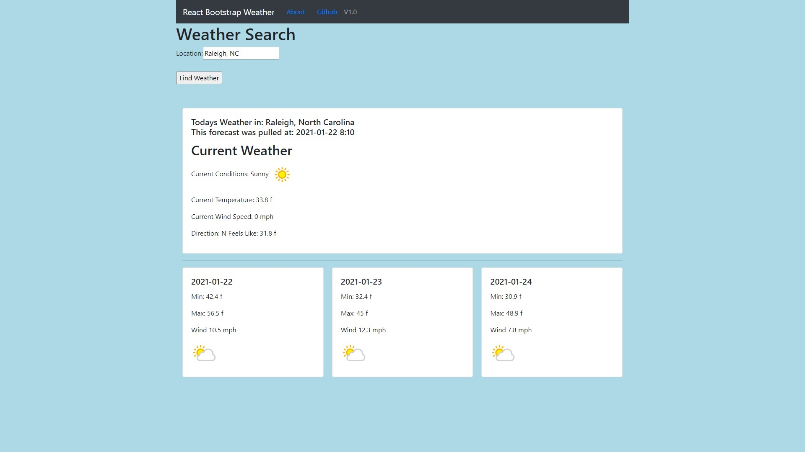

# React Weather App

This page was put together to call external API from the node backend.

## Contents

- [Project](#Project)
- [Usage](#Usage)
- [Technology](#Technology)
- [API](#API)
- [Future Enhancement](#Future%20Enhancement)
- [Contribution](#Contribution)

## Project

The goal behind this project was to create a MERN app for weather forecasts, while the mongoDB aspect is not in use at this time and to be honest it was never really intended to be used, I just added it in because I could. The connection to the database server is in place and functional though should someone wish to implement a method to store the last few requests sent to the page.

## Usage

The page can be visited here:
https://exs-weather-react.herokuapp.com/

The user can enter a location in the search weather field using the following formats and will be returned current conditions along with the 3 day forecast.

- Zipcode or Postal Code: 66210
- City State: Raleigh NC
- City Country: Glasgow GB

## Technology

The following technologies were used in this project along with VS Code

- Axios  
  https://www.npmjs.com/package/axios
- node JS version 14.5.0  
  https://nodejs.org/en/
- React  
  https://reactjs.org/
- React Bootstrap  
  https://react-bootstrap.github.io/

## APIs

WeatherAPI was used to retrieve weather data, using the free tier availablke on their website.

- Weather API  
  https://www.weatherapi.com/

## Future Enhancement

Theres a few things that can and will be cleaned up as I have time:

- Clean up formatting
- Allow local or backend storage of last 5 locations searched
- Display alerts with a box or orange for watch and red for warning.

## Contribution

All code was written by Eddie Saunders

[Github](https://github.com/saundersEddie) • [Facebook](https://www.facebook.com) • [Contact Me](mailto:edwyn.saunders@outlook.com)
